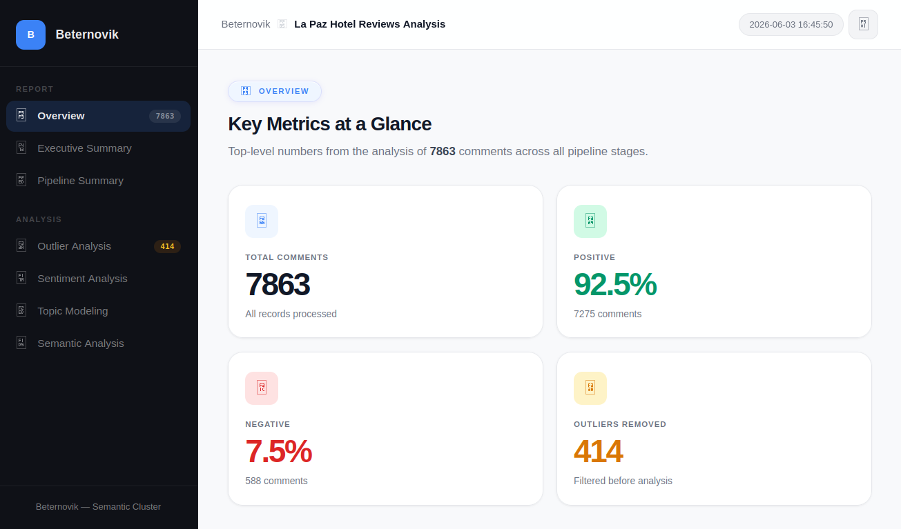
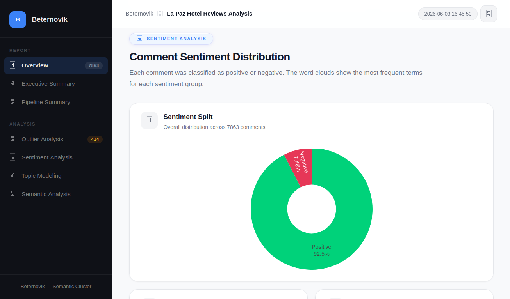
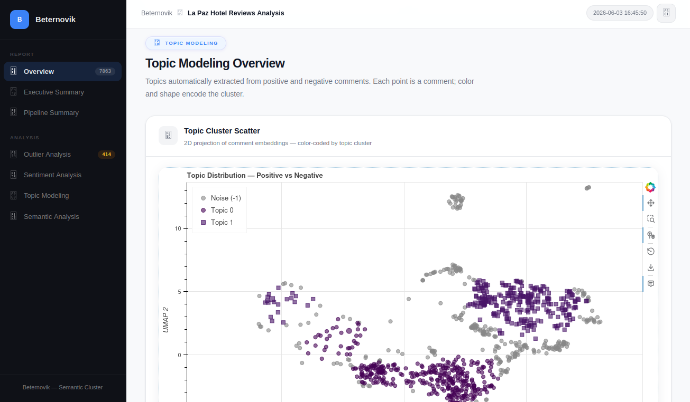
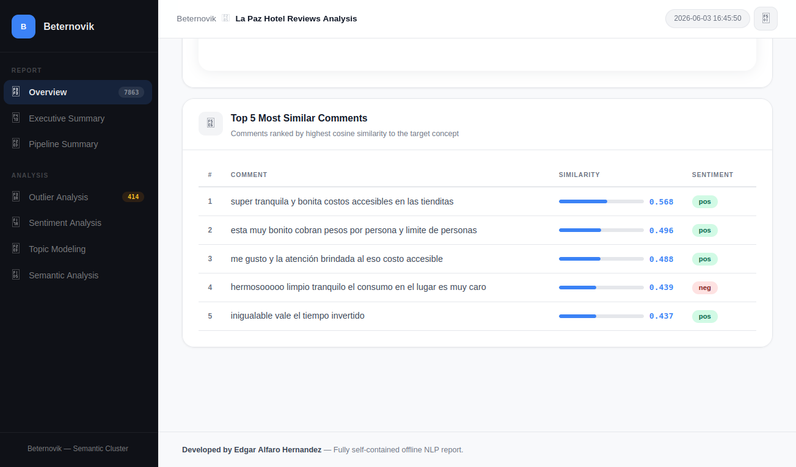

# Semantic Cluster

Fully offline NLP pipeline — topic modeling, sentiment analysis, and semantic search from a single CSV. Generates a self-contained interactive HTML dashboard. No external API calls at runtime.



---

## Quick Start

```bash
git clone https://github.com/<your-org>/semantic-cluster.git
cd semantic-cluster
python -m venv .venv && source .venv/bin/activate
pip install -r requirements.txt
python download_models.py        # one-time: cache models (requires internet)

python main.py \
  --file data/samples/la_paz.csv \
  --column comentario \
  --lang es \
  --title "La Paz Hotel Reviews" \
  --palette viridis \
  --concept "precio valor costo"
```

Open the generated `report.html` in any browser.

---

## Pipeline

1. **Load** — reads any CSV; you specify the text column
2. **Embed** — sentence-transformers converts each comment into a 384-dim vector (SHA-256 cached, reused across all stages)
3. **Detect outliers** — PCA + IsolationForest flags anomalous comments; n-gram charts explain what makes them unusual
4. **Classify sentiment** — dispatches to pysentimiento (es, fr, pt, de) or VADER (en); splits into positive and negative groups
5. **Model topics** — BERTopic clusters each group, extracts keywords via MMR, picks a representative comment per topic. Falls back to word frequency for groups under 100 rows.
6. **Search by concept** — cosine similarity against any phrase you define
7. **Render** — single offline HTML with KPI cards, scatter plots, word clouds, and similarity tables

---

## Screenshots


*Sentiment split — 92.5% positive / 7.5% negative across 7,863 La Paz hotel reviews.*


*2D UMAP projection of comment embeddings. Each point is a comment, color and shape encode the topic cluster.*


*Top 5 comments ranked by cosine similarity to the concept "precio valor costo".*

---

## Usage

```bash
python main.py \
  --file data.csv \
  --column review_body \
  --lang en \
  --title "Analysis Title" \
  --palette viridis
```

| Parameter | Required | Default | Description |
|---|---|---|---|
| `--file` | Yes | — | Path to CSV |
| `--column` | Yes | — | Text column name |
| `--lang` | Yes | — | `es`, `en`, `fr`, `de`, `pt` |
| `--title` | Yes | — | Report title |
| `--palette` | Yes | — | `viridis`, `cividis`, `plasma`, `inferno`, `magma` |
| `--concept` | No | `"precio valor costo"` | Semantic search phrase |
| `--contamination` | No | `0.05` | Expected outlier ratio (0.01–0.15) |
| `--verbose` | No | `False` | DEBUG logging |

---

## Output

A single `report.html` inside a timestamped folder under `outputs/`. Fully self-contained — all assets (Bootstrap, Plotly, Bokeh, images) embedded. Opens in any browser offline.

---

## Project Structure

```
main.py                          # Pipeline orchestrator
download_models.py               # One-time model cache setup
src/
  pipeline/                      # loader, preprocessor, outlier_detector,
                                 # sentiment_analyzer, topic_modeler, semantic_search
  viz/                           # scatter_plot, wordcloud_gen, report_builder,
                                 # new_report_builder (dashboard template)
  utils/                         # color_palettes, language_config, validators
assets/                          # Bootstrap, Plotly, Bootstrap Icons (injected inline)
data/samples/                    # Demo CSVs
tests/                           # 424 tests
docs/screenshots/                # Dashboard screenshots
```

---

## Requirements

Python 3.10+, C++ compiler (for HDBSCAN/UMAP), 4-8 GB RAM recommended.

---

## License

MIT
